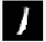
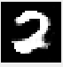
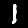
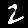

# Autoencoders

This repository has a implementation of the Autoencoder from scratch in modes namely:
1. Fully Connected Layers
2. Convolutional Layers

## Mode1 -- Fully Connected layers

Below mentioned are the number of parameters in each of the layers.
printing the number of parameters in the network

| Modules           | Parameters |
|:-----------------:|:----------:|
| encoder1.0.weight | 200704     |
| encoder1.0.bias   | 256        |
| encoder1.2.weight | 32768      |
| encoder1.2.bias   | 128        |
| decoder1.0.weight | 32768      |
| decoder1.0.bias   | 256        |
| decoder1.2.weight | 200704     |
| decoder1.2.bias   | 784        |

Total Trainable Params: 468368
Number of parameters in encoder= 233856
Number of parameters in decoder= 234512

## Mode2 -- Convolutional Layers

Below mentioned are the number of parameters in each of the layers.
printing the number of parameters in the network

| Modules                  | Parameters |
|:------------------------:|:----------:|
| encoder_decoder.0.weight | 36         |
| encoder_decoder.0.bias   | 4          |
| encoder_decoder.3.weight | 288        |
| encoder_decoder.3.bias   | 8          |
| encoder_decoder.6.weight | 288        |
| encoder_decoder.6.bias   | 4          |
| encoder_decoder.8.weight | 72         |
| encoder_decoder.8.bias   | 2          |
| encoder_decoder.10.weight| 18         |
| encoder_decoder.10.bias  | 1          |

Total Trainable Params: 721
Number of parameters in encoder= 336
Number of parameters in decoder= 385

## Inference
Looking into the parameters in both the models ,it is evident that the number of parameters in Convolutional autoencoder is lesser
when compared to the Fully connected layer encoder. Hence is the reason why convolutional neural network is preferred for images.
And also looking into the images it is pretty clear that conv encoder does the better job than the fully connectd layer encoder.

## Output Images
Images obtained from both the modes has been attached with this repository in their respective folders.

### Mode 1
<kbd></kbd>
<kbd></kbd>

### Mode 2
<kbd></kbd>
<kbd></kbd>
